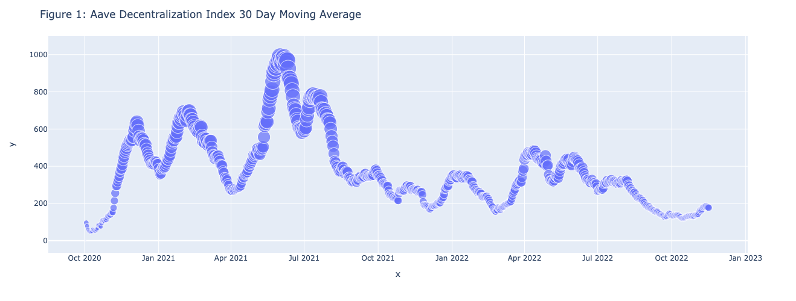
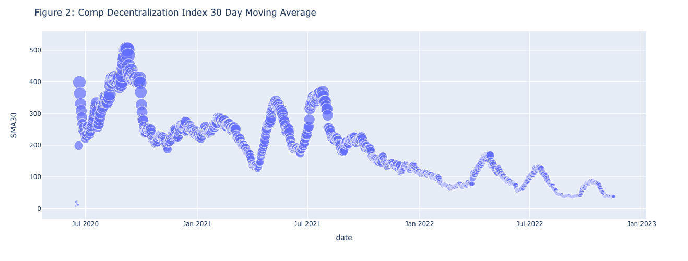
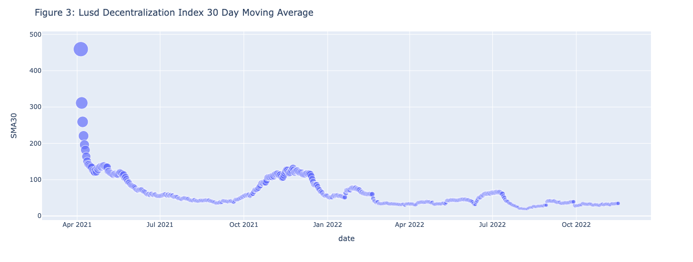
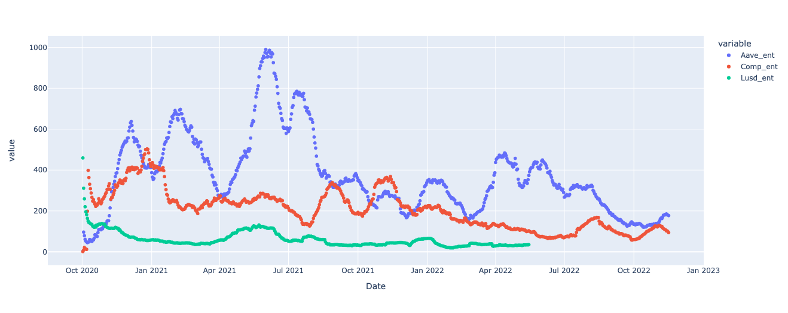

# Aave, Comp, and Lusd data visulization

## Figure 1- Aave Decentralization Index 30 Day Moving Average

Figure 1 is a scatter plot that shows the trend of AAVE token's 30-day moving average of the decentralization index. X-axis shows the dates from Oct 2020 to Jan 2023. Y-axis shows the 30-day moving average of decentralization index. The scatter size represents the average value. When the size of the dot is larger, it has the average value is higher. According to the graph, the highest average value is achieved in June 2021.

## Figure 2- Comp Decentralization Index 30 Day Moving Average

Figure 2 is a scatter plot that shows the trend of Comp token's 30-day moving average of the decentralization index. X-axis shows the dates from Jan, 2020 to Jan, 2023. Y-axis shows the 30-day moving average of decentralization index. The scatter size represents the average index value. When the size of the dot is larger, it has the average value is higher. According to the graph, the highest average value is achieved in Sep 2020.

## Figure 3- Lusd Decentralization Index 30 Day Moving Average

Figure 3 is a scatter plot that shows the trend of Lusd token's 30-day moving average of the decentralization index. X-axis shows the dates from Jan, 2020 to Jan, 2023. Y-axis shows the 30-day moving average of decentralization index. The scatter size represents the average value. When the size of the dot is larger, it has the average value is higher. According to the graph, the highest average value is achieved in April 2021.

## Figure 4- Three Tokens Decentralization Index 30 Day Moving Average

Figure 4 is a scatter plot that shows the trend of the three token's 30-day moving average of the decentralization index. X-axis shows the dates. Y-axis shows the 30-day moving average of decentralization index. According to the graph, the Aave fluctuate the most among the three, and Lusd fluctuate the least.
